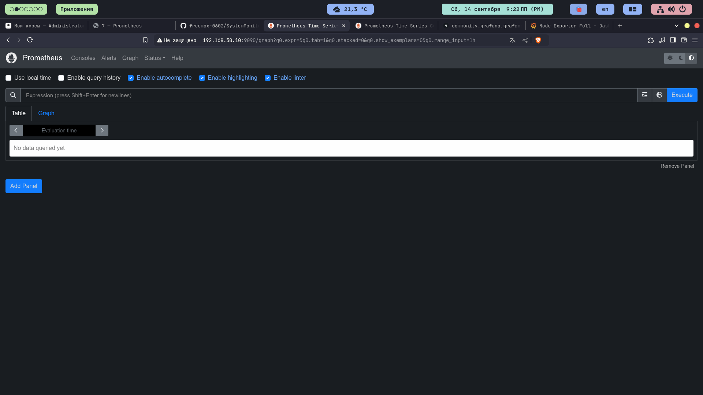

*Домашнее задание №4**

**Тема** ***"Системы мониторинга"***

**Задача**
Настроить дашборд с 4-мя графиками
- память;
- процессор;
- диск;
- сеть.
Настроить на одной из систем:
zabbix (использовать screen (комплексный экран);
prometheus - grafana

**Результат выполнения задания**

Разработана роль ansible для автоматизации установки и конфигурации:
- prometheus
- node exporter
- grafana

В результате получаем: 
- установленный promtheus (http://192.168.50.10:9090/graph)

- установленный node exporter (http://192.168.50.10:9090/targets)

- установленная grafana, с установленным дашбордом, для отслеживания объектов, указанных в задании:

